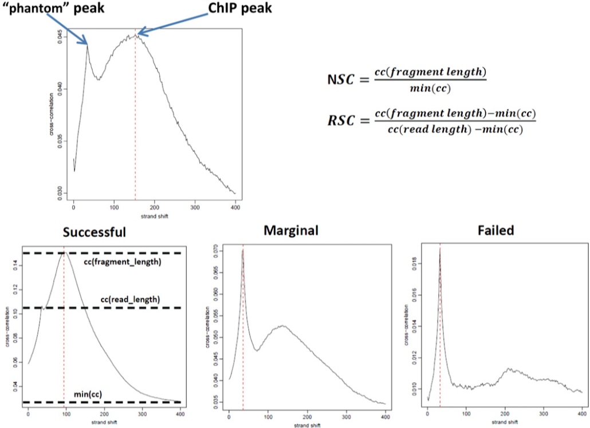

## Phantompeakqualtools
Phantompeakqualtools plots the strand cross-correlation of aligned reads for each sample. In a strand cross-correlation plot, reads are shifted in the direction of the strand they map to by an increasing number of base pairs and the Pearson correlation between the per-position read count vectors for each strand is calculated. Two cross-correlation peaks are usually observed in a ChIP experiment, one corresponding to the read length ("phantom" peak) and one to the average fragment length of the library. The absolute and relative height of the two peaks are useful determinants of the success of a ChIP-seq experiment. A high-quality IP is characterized by a ChIP peak that is much higher than the "phantom" peak, while often very small or no such peak is seen in failed experiments.

*Source: Landt SG et al, Genome Research (2012)*

Normalized strand coefficient (NSC) is the normalized ratio between the fragment-length cross-correlation peak and the background cross-correlation. NSC values range from a minimum of 1 to larger positive numbers. 1.1 is the critical threshold. Datasets with NSC values much less than 1.1 (< 1.05) tend to have low signal to noise or few peaks (this could be biological eg. a factor that truly binds only a few sites in a particular tissue type OR it could be due to poor quality). ENCODE cutoff: NSC > 1.05.

Relative strand correlation (RSC) is the ratio between the fragment-length peak and the read-length peak. RSC values range from 0 to larger positive values. 1 is the critical threshold. RSC values significantly lower than 1 (< 0.8) tend to have low signal to noise. The low scores can be due to failed and poor quality ChIP, low read sequence quality and hence lots of mismappings, shallow sequencing depth (significantly below saturation) or a combination of these. Like the NSC, datasets with few binding sites (< 200), which is biologically justifiable, also show low RSC scores. ENCODE cutoff: RSC > 0.8.
